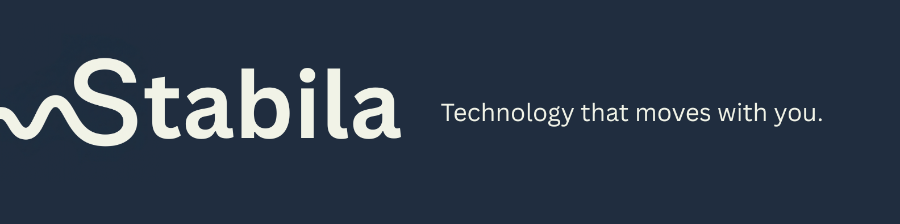

<p align="center">
  
</p>


# Stabila
> Helping people with hand tremors interact with technology with greater confidence and independence.

[](https://kotlinlang.org)
[](https://developer.android.com)
[](https://developer.android.com/jetpack/compose)
[](#-architecture)
[](LICENSE)

**Stabila** is an assistive Android app designed to make everyday digital interactions easier for people experiencing hand tremors.


---

## 🌟 What Stabila Does

### 🛡️ Touch Stabilizer
Reduces the impact of involuntary movements while interacting with the screen, helping make taps, presses, and dragging more controlled.

### 📜 Auto-Scroll
Allows users to automatically scroll through content at a comfortable, adjustable speed without repeatedly swiping.

### 📷 SteadyCam
Helps users capture clearer photos by detecting moments of greater physical stability and applying low-light enhancement.

### ✍️ Daily Tremor Test
Provides a simple daily test using an Archimedean spiral to track tremor patterns over time.

### 📊 Tremor History & Reports
Stores previous test results and presents them as trends and reports that can be shared with healthcare professionals.

### ⌨️ Accessible Keyboard
A keyboard designed with larger keys, touch-dampening, and haptic feedback to make typing easier.

### 🎨 Adaptive Interface
Adjusts aspects of the interface based on the user's tremor level to make important controls easier to interact with.

---

## 🎯 Why Stabila?

Hand tremors can make simple interactions with a smartphone unexpectedly difficult.

Stabila aims to reduce that friction by providing practical accessibility tools that work together in a single Android application.

The goal is simple:

**Make everyday technology easier to use.**

---

## ⚡ Tech Stack

- **UI**: Jetpack Compose & Material 3
- **DI**: Hilt (Dagger)
- **ML**: TensorFlow Lite (Zero-DCE Photo Enhancement & Spiral ML Classifier)
- **Storage**: Room DB & Preferences DataStore
- **System Services**: Accessibility API, IME Keyboard, Quick Settings Tile, CameraX

---

## 🚀 Getting Started

### For Users

Download the latest APK from the [latest release](https://github.com/Tantawi65/Stabila/releases/latest).

After installation, follow the in-app instructions to enable the required accessibility and system permissions.

### For Developers

Clone the repository and open it with Android Studio.

```bash
git clone https://github.com/Tantawi65/Stabila.git
cd Stabila
```
---

## 🔑 Permissions Checklist

To enable full stabilization, grant these permissions on your device:

| Permission | Purpose | Location |
| :--- | :--- | :--- |
| **Accessibility** | System-wide touch dampening & auto-scroll | `Settings -> Accessibility -> Stabila` |
| **Display Over Apps** | Floating auto-scroll controls | `Settings -> Special App Access -> Display Over Other Apps` |
| **Camera** | SteadyCam photo capture | Prompted in-app |
| **Custom Keyboard** | Tremor-dampened typing | `Settings -> Languages & Input -> Manage Keyboards` |

